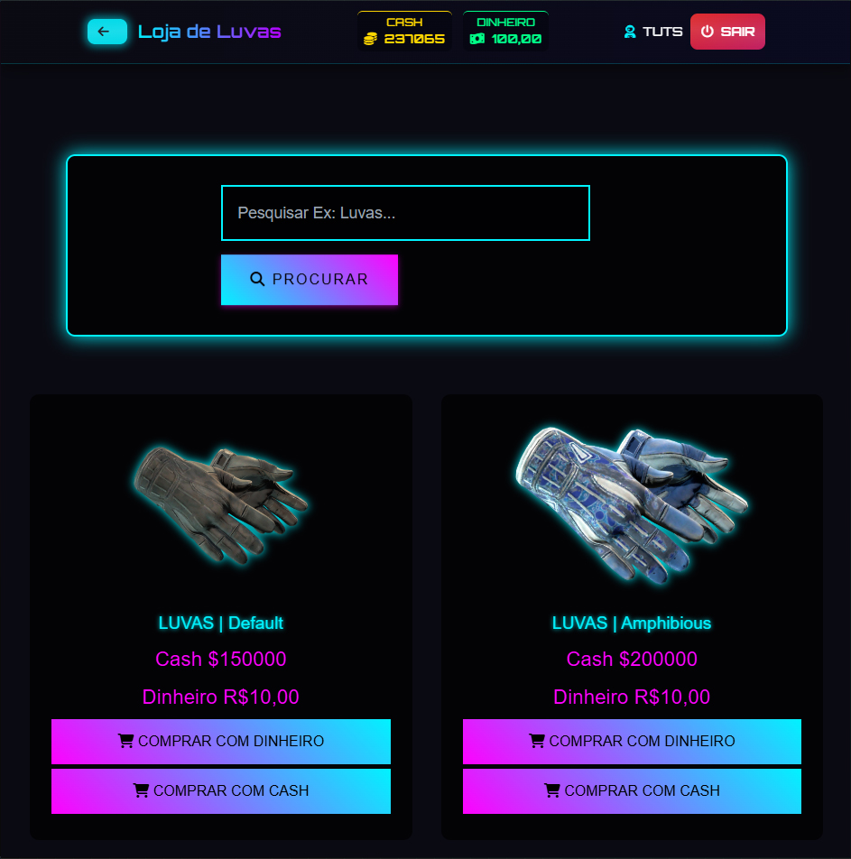
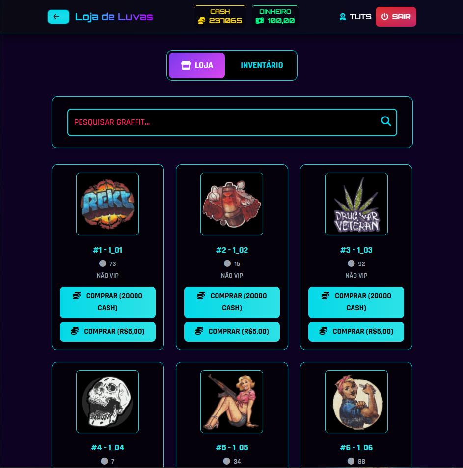
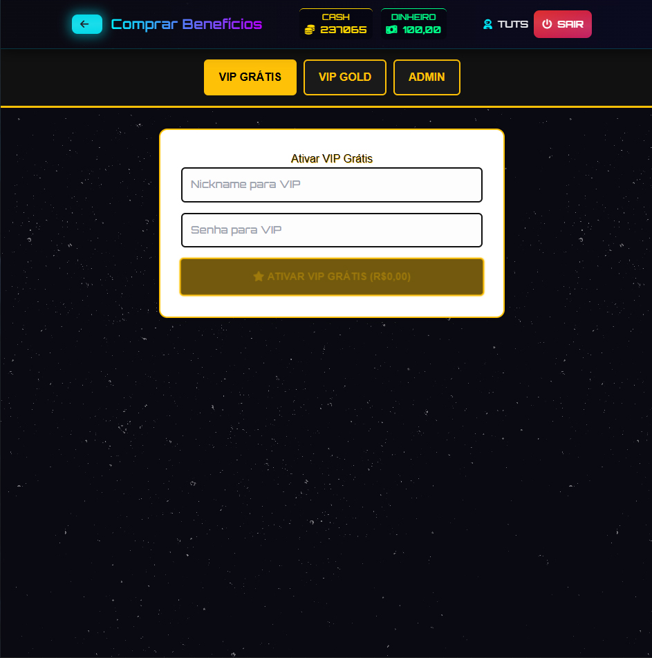
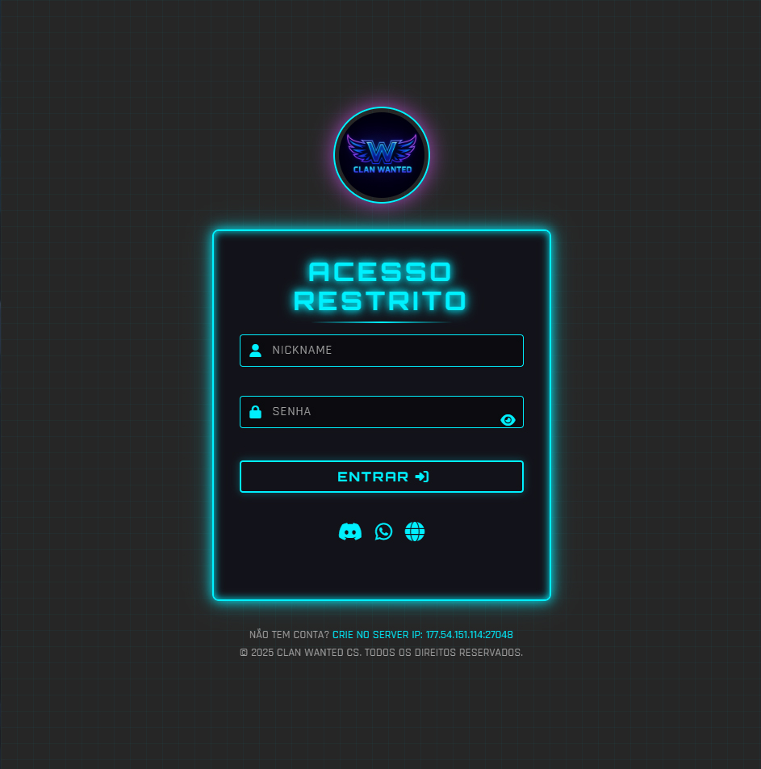

# CSGO Mod para CS 1.6

Projeto web desenvolvido para integração direta com **servidores Counter-Strike 1.6 utilizando Mod CSGO**, oferecendo sistemas completos de economia, personalização e progressão do jogador.

Todo o site é totalmente **vinculado ao servidor**, funcionando como extensão do gameplay.

---

## Visão Geral

A plataforma foi criada para ampliar a experiência dos jogadores dentro do servidor CS 1.6, trazendo mecânicas inspiradas no CS:GO, como caixas, skins, inventário e loja, tudo sincronizado em tempo real com o jogo.

---

## Funcionalidades Principais

### Sistema de Abertura de Caixas
- Abertura de caixas diretamente pelo site  
- Itens vinculados à conta do jogador  
- Integração total com o servidor  
---

### Sistema de Skins de Personagens
- Skins visuais aplicadas no servidor  
- Inventário persistente  
- Gerenciamento completo pelo site  

---

### Loja de Skins, Luvas e Grafites
- Compra de skins e luvas  
- Sistema de inventário de grafites  
- Itens disponíveis para uso no servidor  

---

### Sistema de VIP e Administração
- Compra de VIP  
- Compra de VIP Gold  
- Compra de Admin  
- Ativação automática no servidor  

---

### Login Integrado com o Servidor
- Login sincronizado com a conta do jogador  
- Dados vinculados ao servidor CS 1.6  
- Segurança e persistência de informações

- 

---

### Sistema de Pagamentos
- Compra de saldo e cash  
- Integração com **Mercado Pago**  
- Processamento automático dos créditos  

---

## Tecnologias Utilizadas

- Front-end Web integrado ao servidor CS 1.6  
- Backend conectado ao Mod CSGO  
- Integrações com sistema de pagamento  
- Comunicação direta entre site e servidor  

---

## Integração com o Servidor

- Todas as compras refletem diretamente no jogo  
- Inventário sincronizado  
- Sistema de economia unificado  
- Comunicação contínua entre site e servidor  

---

## Observação Importante

Este repositório contém **apenas imagens e documentação** do projeto.  
O código-fonte não é público por conter regras de negócio, integrações diretas com o servidor e informações sensíveis.

---

## Status do Projeto

Projeto funcional e utilizado em ambiente real, desenvolvido para servidores CS 1.6 com foco em:
- Experiência do jogador
- Monetização
- Estabilidade
- Integração total com o jogo

---

## Autor

**Vinicius França**  
Desenvolvedor Web  
Projetos Web Integrados a Servidores de Jogos
